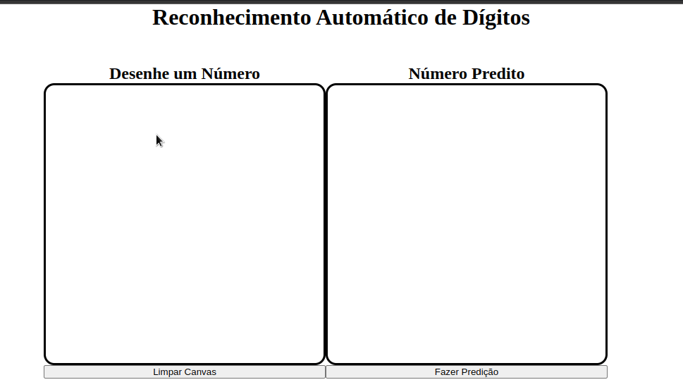
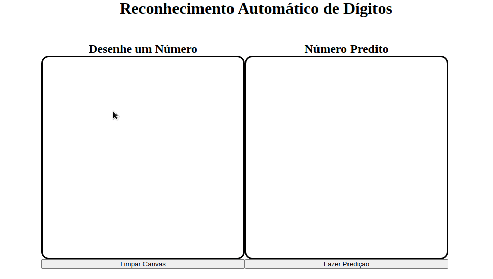

# Reconhecimento Automático de Dígito Manuscrito
Aplicação web simples que prevê número desenhado em um canvas utilizando modelo de **machine learning**
 
 

## Tecnologias Utilizadas

   
   
  

 
 

## Treinamento
O treinamento do modelo de machine learning foi feito em linguagem python utilizando o framework **Tensorflow** e a base de dados **MNIST**. No total são 60 mil imagens de treino e 10 mil imagens de teste.
 
 

## Predição
A predição foi feita com o framework **TensorflowJs** na linguagem javascript. O original foi convertido em formato compatível com TensorfloJs.

## Aplicação
A aplicação pode ser acessada <a href=https://lucas-morais.github.io/reconhecimento-automatico-de-digito-manuscrito/>aqui</a>

## Snippets

 
 

